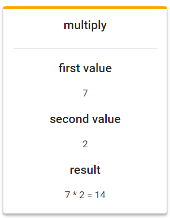
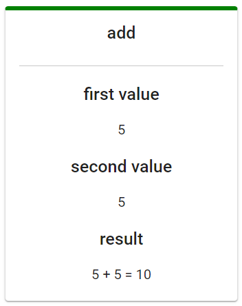
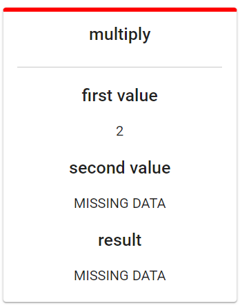

# Angular challenge

## preview
 To visit project click [here](https://angular-challenge-6c63f.web.app/).

> show multiply operations with orange border :orange_circle:

> show add operations with green border. :green_circle:

> show MISSING DATA error with red border. :red_circle:

  

## Details

### header
There is Three button in header that can filter operations according to action's type.
these buttons are router link, and this button change query of url.
for these buttons used angular material button.

### main section
list-items component has been used for display operations and to display each item has been used 
item component and require data pass to it from list-items component.

## services

4 service has been used in this project:

- fetch-data: This service fetch require data from asset folder(Add.json, Multiply.json, Number.json) 
and give observable object to subscribe. in every function in this service used one or more pipe operation to prepare data for subscribe
in `getActionValue()` function after use `number()` and get observable by using mergeMap operation in pipe use another observable, finally their result merge together.
- get-data: In this service used fetch-data service. this service filter data according to action type.
list-items component use this service for getting data.
- error: components that want to generate and receive error used this service.
- loading: this service for turning on and turning off load state.

## shared module
in this module declare component and services that used in whole of project such as loading and error component. component of material angular that used in this project declare in this module as well

## test

To all component and services, unit tests have been performs.

